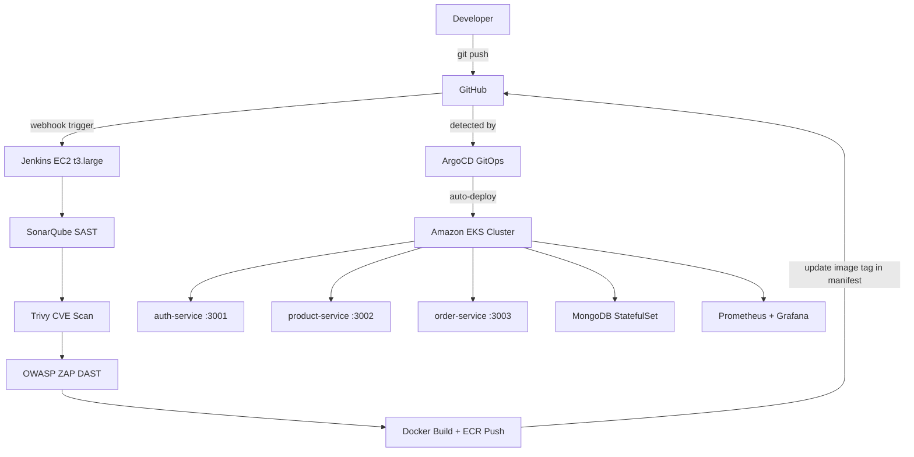

# 🛒 DevSecOps E-Commerce Platform on AWS

A production-grade **DevSecOps project** built on AWS with 3 Node.js microservices, full CI/CD pipeline, GitOps, and monitoring stack.


---

## 🏗️ Architecture



---

## 🚀 Tech Stack

| Category | Technology |
|----------|-----------|
| Cloud | AWS — EKS, ECR, ALB, IAM, EBS, VPC |
| Containers | Docker |
| Orchestration | Kubernetes — Amazon EKS 1.32 |
| CI/CD | Jenkins |
| IaC | Terraform |
| GitOps | ArgoCD |
| Code Quality | SonarQube |
| Container Security | Trivy |
| DAST | OWASP ZAP |
| Monitoring | Prometheus + Grafana + AlertManager |
| Database | MongoDB StatefulSet |
| Backend | Node.js + Express |

---

## 📁 Project Structure

```
devops-ecommerce/
├── services/
│   ├── auth-service/          # JWT auth (port 3001)
│   ├── product-service/       # Products (port 3002)
│   └── order-service/         # Orders (port 3003)
├── k8s/
│   ├── auth/                  # Deployment, Service, Secret
│   ├── product/               # Deployment, Service, Secret
│   ├── order/                 # Deployment, Service, Secret
│   ├── mongo/                 # StatefulSet, Service, Secret
│   ├── ingress/               # AWS ALB Ingress
│   └── monitoring/            # Prometheus alert rules
├── terraform/                 # VPC, EKS, EC2, IAM, EIP
├── argocd-app.yaml            # ArgoCD Application
├── Jenkinsfile                # CI/CD pipeline
├── docker-compose.yml         # Local dev
└── sonar-project.properties   # SonarQube config
```

---

## 🔄 CI/CD Pipeline

Every `git push` to `main` triggers the full pipeline:

```
Checkout → Install Deps → Tests → SonarQube → Quality Gate
→ Docker Build → Trivy Scan + ZAP Scan + ECR Push (parallel)
→ Update K8s manifest → ArgoCD detects → EKS deploys
```

---

## 🌐 API Endpoints

| Endpoint | Method | Auth | Description |
|----------|--------|------|-------------|
| `/auth` | GET | No | Service health check |
| `/auth/register` | POST | No | Register new user |
| `/auth/login` | POST | No | Login and get JWT token |
| `/products` | GET | JWT | Product service |
| `/products/user` | GET | JWT | Get user info from token |
| `/orders` | GET | JWT | Order service |
| `/orders/user` | GET | JWT | Get user info from token |
| `/health` | GET | No | Health check |

### Quick Test

```bash
# Register
curl -X POST http://<ALB_URL>/auth/register \
  -H "Content-Type: application/json" \
  -d '{"email":"test@test.com","password":"test123"}'

# Login and get token
TOKEN=$(curl -s -X POST http://<ALB_URL>/auth/login \
  -H "Content-Type: application/json" \
  -d '{"email":"test@test.com","password":"test123"}' | \
  grep -o '"token":"[^"]*"' | cut -d'"' -f4)

# Access protected services
curl -H "Authorization: Bearer $TOKEN" http://<ALB_URL>/products
curl -H "Authorization: Bearer $TOKEN" http://<ALB_URL>/orders
```

---

## ⚙️ Infrastructure

### Provision with Terraform

```bash
cd terraform
terraform init
terraform plan
terraform apply
terraform output jenkins_elastic_ip
```

### AWS Resources

| Resource | Details |
|----------|---------|
| Region | ap-south-1 (Mumbai) |
| EKS Cluster | devops-ecommerce — K8s 1.32 |
| EKS Nodes | 2x t3.medium |
| Jenkins EC2 | t3.large — Jenkins + SonarQube |
| Jenkins IP | Elastic IP (permanent) |
| VPC CIDR | 10.0.0.0/16 |
| Public Subnets | 10.0.1.0/24, 10.0.2.0/24 |
| Private Subnets | 10.0.3.0/24, 10.0.4.0/24 |

---

## 🚢 Deploy to Kubernetes

```bash
# Configure kubectl
aws eks update-kubeconfig --region ap-south-1 --name devops-ecommerce

# Apply all manifests in order
kubectl apply -f k8s/mongo/
kubectl apply -f k8s/auth/
kubectl apply -f k8s/product/
kubectl apply -f k8s/order/
kubectl apply -f k8s/ingress/

# Verify everything is running
kubectl get pods -n devops-ecommerce
kubectl get ingress -n devops-ecommerce
kubectl get svc -n devops-ecommerce
```

---

## 🔧 Local Development

```bash
# Clone the repo
git clone https://github.com/vasigaran-P/devops-ecommerce
cd devops-ecommerce

# Start all services with Docker Compose
docker-compose up --build
```

Services available locally at:
- auth-service → http://localhost:3001
- product-service → http://localhost:3002
- order-service → http://localhost:3003
- MongoDB → localhost:27017

---

## 🔁 GitOps Flow

ArgoCD watches the `k8s/` folder in this repo. When Jenkins updates an image tag and pushes, ArgoCD automatically detects and deploys to EKS — no manual `kubectl apply` needed.

```bash
# Check ArgoCD sync status
kubectl get application -n argocd
```

---

## 📊 Monitoring

| Tool | URL | Credentials |
|------|-----|-------------|
| Grafana | http://\<GRAFANA_ALB\> | admin / Admin@1234 |
| Prometheus | http://\<PROMETHEUS_ALB\>:9090 | No auth |
| AlertManager | Built into Prometheus stack | — |

### Custom Alert Rules

| Alert | Severity | Condition |
|-------|----------|-----------|
| PodCrashLooping | Critical | Pod restarts > 0 in last 5m |
| PodNotReady | Warning | Pod not ready for 2+ minutes |
| HighCPUUsage | Warning | CPU > 80% for 5+ minutes |
| HighMemoryUsage | Warning | Memory > 80% for 5+ minutes |
| MongoDBDown | Critical | MongoDB pod not ready for 1m |

---

## 🔒 Security Features

| Tool | What It Does |
|------|-------------|
| Trivy | Scans Docker images for CVEs before pushing to ECR |
| OWASP ZAP | Dynamic security testing against live app URL |
| SonarQube | Static code analysis — bugs, vulnerabilities, code smells |
| K8s Secrets | All credentials stored as Kubernetes Secrets, never in code |
| IAM Roles | EC2 and EKS use IAM roles — no hardcoded AWS keys |
| Private Subnets | EKS nodes in private subnets — not directly internet-exposed |
| ECR | Private container registry with IAM-based access control |

---

## 🛠️ Jenkins Pipeline Stages

```
1. Checkout           // Pull latest code from GitHub
2. Install Deps       // npm ci for all 3 services
3. Run Tests          // npm test --if-present
4. SonarQube          // Static code analysis
5. Quality Gate       // Block if quality fails
6. Docker Build       // Build images with git commit SHA tag
7. Parallel:
   Trivy Scan         // CVE vulnerability scan
   OWASP ZAP          // Dynamic security scan on live app
   ECR Push           // Push images to Amazon ECR
8. Update Manifests   // Update image tag, push to GitHub, ArgoCD deploys
```

---

## 📋 Prerequisites

- AWS CLI configured (`aws configure`)
- Terraform >= 1.0
- kubectl
- Helm 3
- Docker
- Node.js 18+
- SSH key at `~/.ssh/jenkins_key.pub`
- GitHub Personal Access Token (for Jenkins git push)

---

## 🐛 Common Issues & Fixes

| Issue | Fix |
|-------|-----|
| ErrImagePull on pods | Attach `AmazonEC2ContainerRegistryReadOnly` to EKS node role |
| MongoDB PVC Pending | Install EBS CSI driver addon on EKS |
| ALB not provisioning | Attach `ElasticLoadBalancingFullAccess` to ALB controller IRSA role |
| Jenkins detached HEAD | Use `git checkout -B main origin/main` before git operations |
| SonarQube Quality Gate fail | Create custom gate without coverage condition |

---

## 👤 Author

**Vasigaran P**
- GitHub: [@vasigaran-P](https://github.com/vasigaran-P)

---

